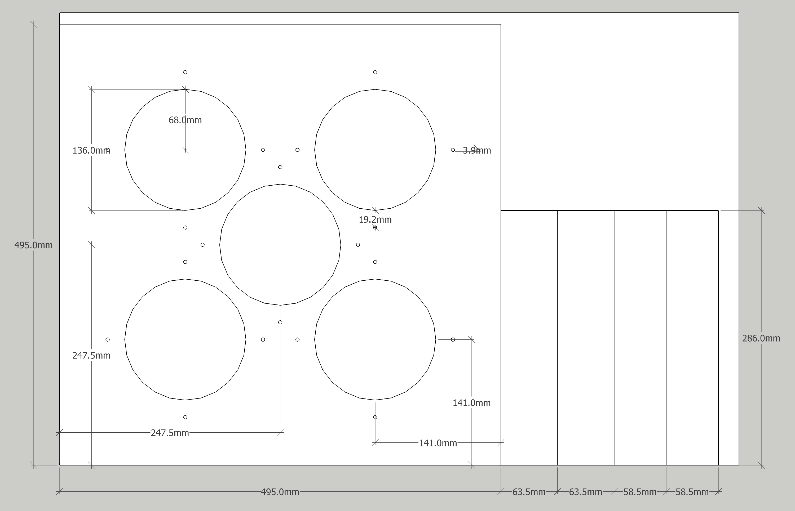
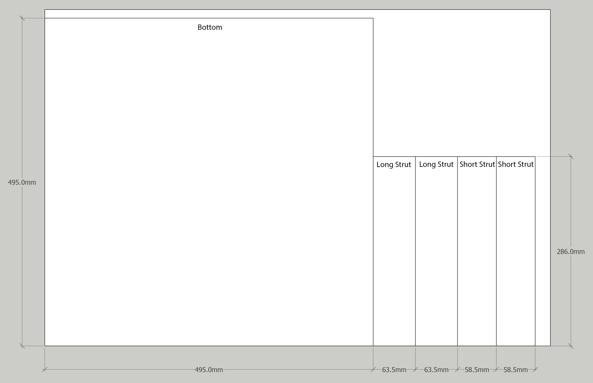
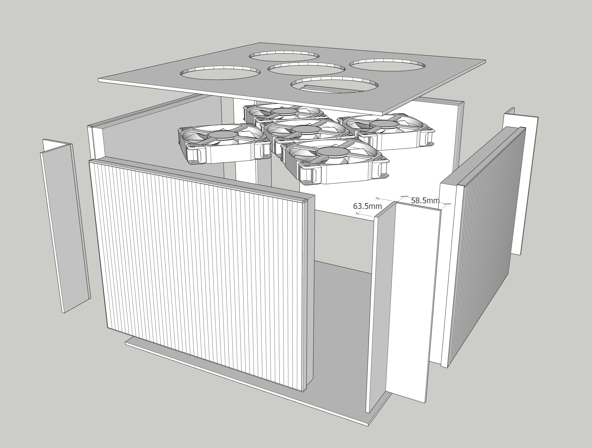
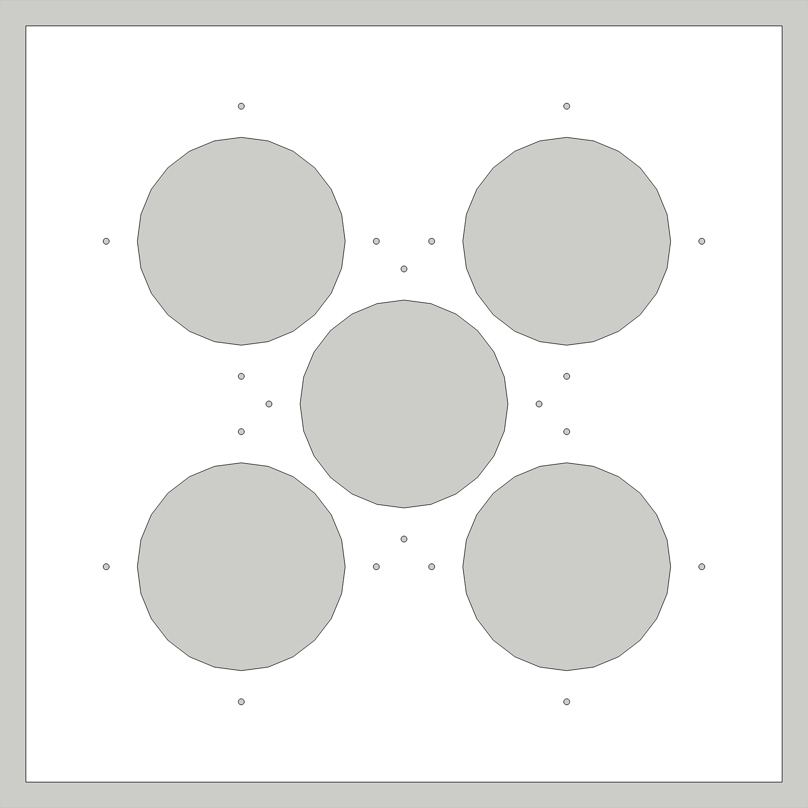

# General Info

The info from the twitter thread announcing the build is in [5 P14 4 Starkvind.pdf](5%20P14%204%20Starkvind.pdf)

See thread: https://twitter.com/robwiss/status/1556318784452952065?s=20&t=9SlZ11GXjnzg0ekXeVtclA

# Test Data

Test data for measuring CADR is available from three trials in the data/ folder. Data was collected with both the SDS011 and Sensirion SPS30 sensors and is available for both. The SPS30 data also contains temperature and humidity data, which was collected using a pimoroni enviro+. Enviro+ was distanced from pi using a gpio cable to prevent CPU heat from affecting temperature and humidity measurements.

# Detailed Images for Build

## Sheet 1

Where all the parts cut out of the first 20" x 30" sheet.

## Sheet 2

Where all the parts cut out of the second 20" x 30" sheet.

## Exploded

Exploded view of all parts

# Template for Cutting the Top

Print this png 20.5" x 20.5" at 96 dpi to get a template for creating the top of the purifier.

Alternatively, print [this pdf](top_template_lettersize.pdf) on letter paper and stitch it together.
